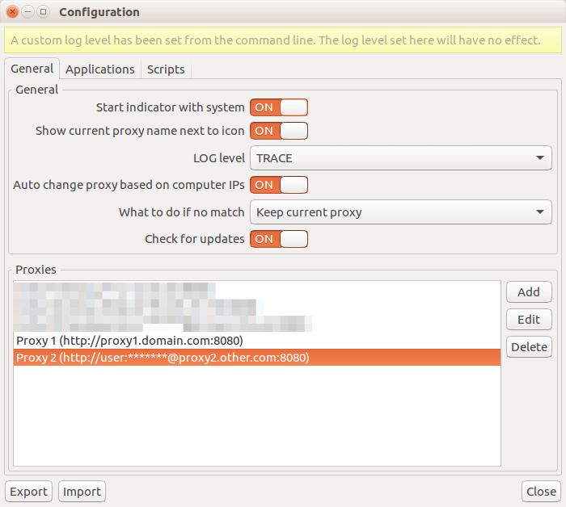
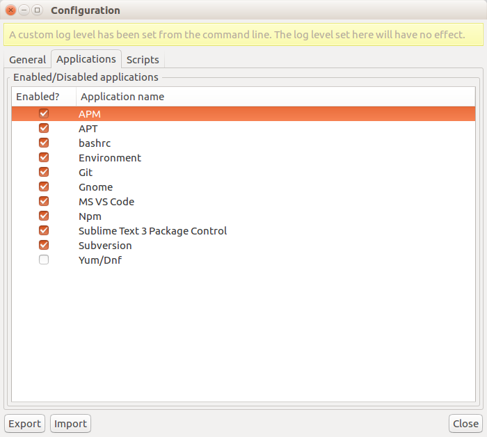
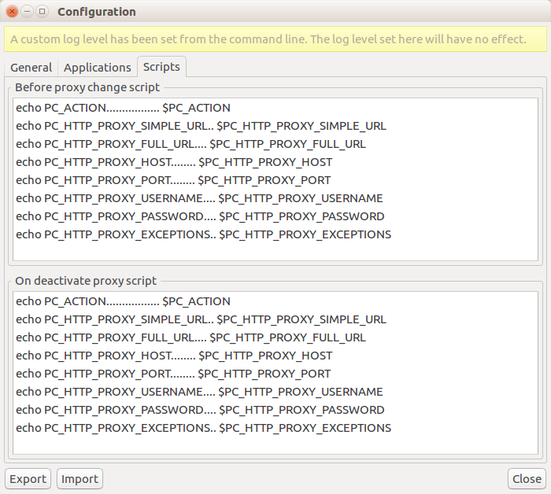
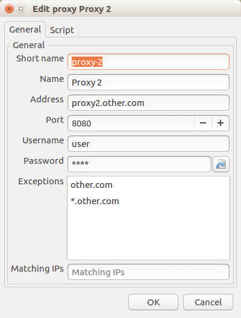
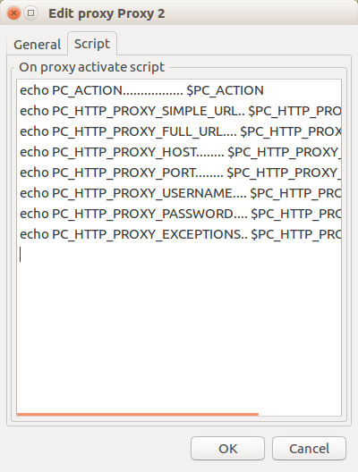
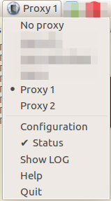

# Proxy changer

[](https://gitter.im/okelet/Lobby)
[](https://travis-ci.org/okelet/proxychanger)
[](https://github.com/okelet/proxychanger/releases/latest)
[](https://github.com/okelet/proxychanger/releases)
[](https://paypal.me/okelet/5)

Proxy changer is an application that allows you to define multiple proxies and change the settings of multiple
applications:

* apt (Atom Package Manager)
* apt/apt-get (Debian/Ubuntu)
* .bashrc
* Docker CLI
* Docker Service/Daemon
* Environment
* git
* Gnome
* Maven
* npm (Node.js Package Manager)
* SSH configuration (~/.ssh/config, using `corkscrew`)
* subversion
* yum/dnf (Red Hat/CentOS/Fedora)
* Microsoft Visual Studio Code
* Sublime Text 3 Package Control

The application, when running as a desktop application, creates an indicator, so you can switch quickly
from there. It also has a configuration dialog, where you can add/edit/remove the proxies, and enable or
disable the applications you want to configure.

There is also a command line mode, that allows you to add, edit and remove the proxies, and set the current
active proxy.

```bash
proxychanger -h
```


## Features

* Tested in recent versions of Ubuntu and Fedora (should work in similar distributions)
* Show current proxy name next to indicator
* Checks updates from GitHub releases
* Auto change the proxy according to computer IPs
* Stores the proxies passwords in the keyring
* Autodetect installed applications, skipping not available to avoid errors
* Shows possible applications errors
* Notifications when a new proxy is set
* CLI to list, add, edit, remove and set proxies
* DBus control; if the indicator is running, the CLI connects to the already running instance
* Run custom scripts when a proxy is set/unset


## Installation 

There is no `apt` or `yum` repository available; only a shell script that downloads and configures
the needed resources (desktop shortcut, icon, locales) and the latest release; it also checks some dependencies
required to run the script and the program itself. You can review the script [here](install.sh). To install,
just execute this: 

```bash
curl -sSfL https://github.com/okelet/proxychanger/raw/master/install.sh | bash
```

After installation, you will find a shortcut in the applications menu. 


## Screenshots

Configuration window:



List of supported applications:



Global scripts:



Proxy configuration:



Proxy scripts:



Indicator:




## Desktop dependencies

In some Gnome Shell based desktops (for Example, Fedora15+), you will need the 
[KStatusNotifierItem/AppIndicator Support](https://extensions.gnome.org/extension/615/appindicator-support/) Gnome Shell extension.

As a quick guide, you will need the package `chrome-gnome-shell`; in Fedora, you can install it running this command:

```bash
sudo yum install chrome-gnome-shell
```

After that, restart the browser. Now, the Firefox extension for Gnome Shell must be installed from [this url](https://addons.mozilla.org/en-US/firefox/addon/gnome-shell-integration/). The last thing is install the extension itself from [this URL](https://extensions.gnome.org/extension/615/appindicator-support/).

In Ubuntu 17.10+, that also uses Gnome Shell, you shouldn't have to do anything, because the extension should be already present, as it is configured during the installation. Anyway, if needed, the installation instructions are very similar (using `apt-get` instead of `yum`).


## Developing

Update translations:

```bash
bash update_translations.sh
```

Reinstall from local folder after translations or something have changed using the script [`install_dev.sh`](install_dev.sh) (code, icon, shortcuts, assets...):

```bash
bash install_dev.sh
```

Run:

```bash
~/tmp/proxychanger
```

## Release procedure

* Commit and push the latest changes
* Wait for Travis to [build ok](https://travis-ci.org/okelet/proxychanger)
* Tag the new version (`git tag xxxx`)
* Push the tag (`git push --tags`)
* Travis should build again successfully and upload the binary to Github


## How to translate

Very simple:

- Install package `gettext` (`sudo apt-get install gettext` or `sudo yum install gettext`)
- Fork the repository ([GitHub help](https://help.github.com/articles/fork-a-repo/)).
- Create a directory with the language code under the [`locale`](locale) directory.
- Install [`go-xgettext`](https://github.com/gosexy/gettext) (`go get github.com/gosexy/gettext/go-xgettext`)
- Run the script [`update_translations.sh`](update_translations.sh).
- Open the file `locale/[new language]/LC_MESSAGES/proxychanger.po` with a tool like [Poedit](https://poedit.net).
- Commit the changes and create a pull request ([GitHub help](https://help.github.com/articles/creating-a-pull-request-from-a-fork/)).


## Me

Website (in spanish): https://okelet.github.io

Email: okelet@gmail.com
